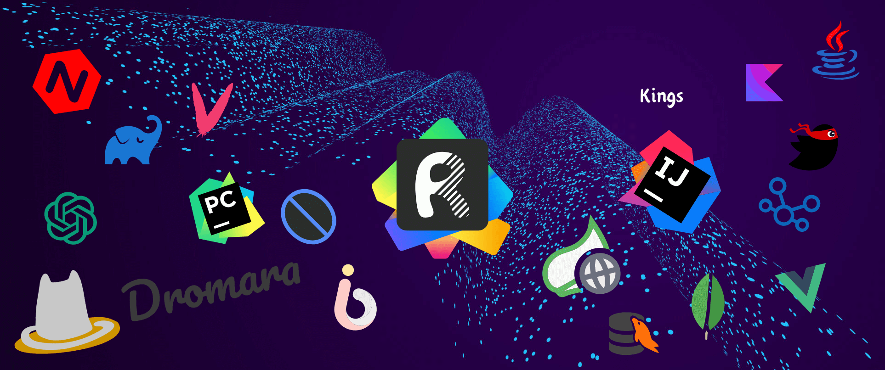

About me: [https://bento.me/darkings](https://bento.me/darkings)

> IDEA plugin

* Plugin homepage [https://plugins.jetbrains.com/organizations/kings1990](https://plugins.jetbrains.com/organizations/kings1990)
* Website [https://api-buddy.com/en](https://api-buddy.com/en)

### Activity

<a href="https://next.ossinsight.io/widgets/official/compose-user-dashboard-stats?user_id=8969637" target="_blank" style="display: block" align="center">
  <picture>
    <source media="(prefers-color-scheme: dark)" srcset="https://next.ossinsight.io/widgets/official/compose-user-dashboard-stats/thumbnail.png?user_id=8969637&image_size=auto&color_scheme=dark" width="771" height="auto">
    
  </picture>
</a>

### Thanks for visiting :heart:

 

counting of visitors to this page in this section started from Aug 4, 2024

<!-- -->

<!--
**kings1990/kings1990** is a ✨ _special_ ✨ repository because its `README.md` (this file) appears on your GitHub profile.

Here are some ideas to get you started:

- 🔭 I’m currently working on ...
- 🌱 I’m currently learning ...
- 👯 I’m looking to collaborate on ...
- 🤔 I’m looking for help with ...
- 💬 Ask me about ...
- 📫 How to reach me: ...
- 😄 Pronouns: ...
- ⚡ Fun fact: ...
-->

<!-- 
活到老学到老!

> 目标
  1. 源码剖析和框架定制能力
  2. 平台性能分析和调优能力
  3. 分布式架构设计能力
  4. 海量数据存储能力
  5. 高并发处理能力
  6. 解决方案和中间件实战能力
  7. 容器技术应用和集群化部署能力
  8. 海量数据搜索和实时计算能力

加油!!!🤪 -->

<!--  -->

<!-- > My Intellij plugin  

> Component

 

> Language  

-->

